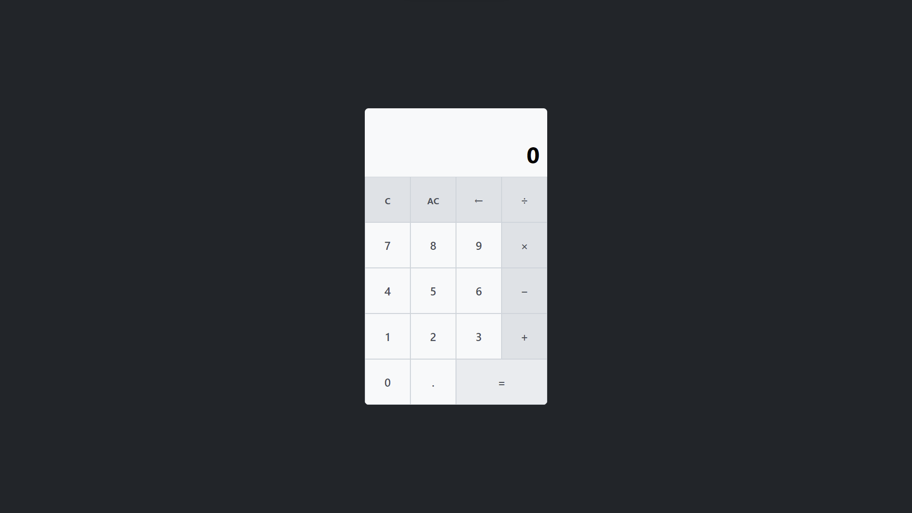

# A simple vanilla calculator

This started me testing some css and javascript stuff and finished in a self challenge to create a calculator in vanilla js 🙃

> Note: I use vite to make the development more friendly, but that's all

## Live version

https://axelvc-calculator.netlify.app

## Preview

